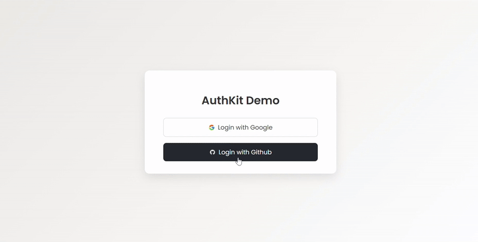
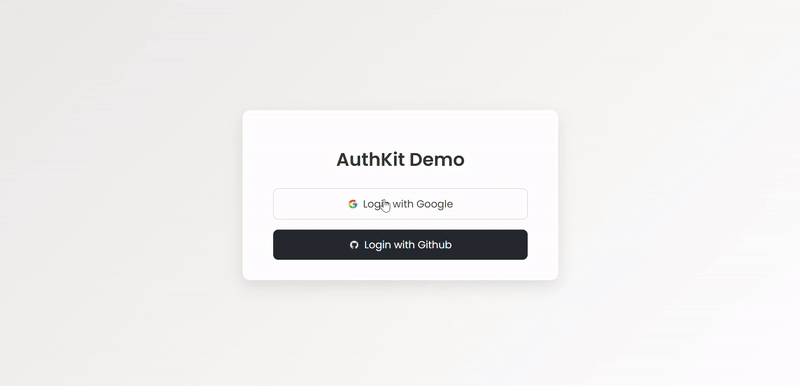
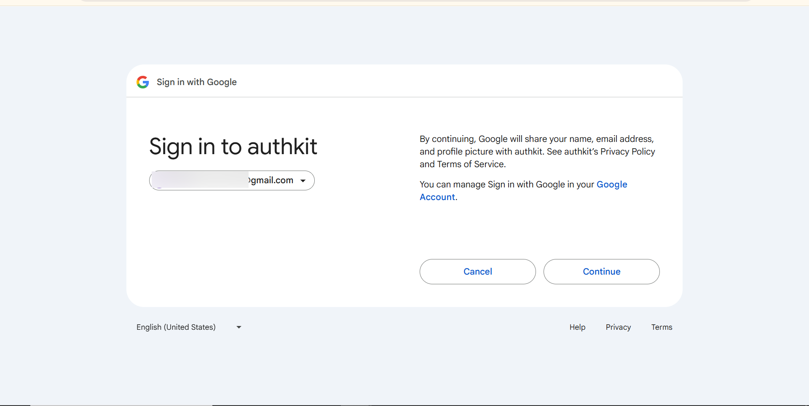
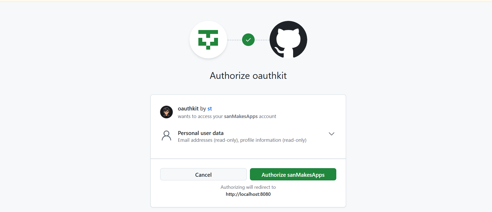
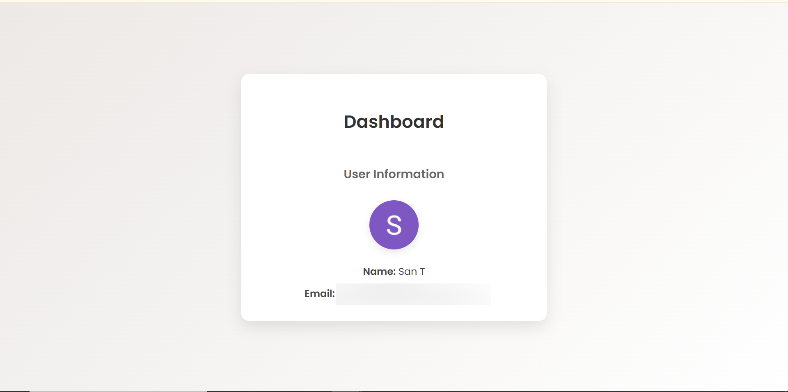

# 🔐 OAuth2 Login Demo – Spring Boot + React

This is a simple OAuth2 demo project that integrates **Spring Boot (backend)** and **React (frontend)** to enable authentication via **Google** and **GitHub** using the **Authorization Code Flow**. The purpose of this project was to **understand why OAuth2 was introduced**, what problems it solves, and how to implement it in a modern full-stack app.

---

## 🎥 Demo

### Login + Consent Github 


### Login + Consent Google   


---

## 📸 Demo Screenshots

### OAuth2 Consent Flow Google 


### OAuth2 Consent Flow Github 


### Dashboard  



---

## 🎯 Goals

- Learn and implement **OAuth2 login flow**
- Explore **Google Cloud Console** and **GitHub Developer Settings** for OAuth setup
- Understand **Spring Security's OAuth2 client** features
- Practice cross-origin communication and authentication handling with React

---

## 🤔 Why OAuth2?

Before OAuth2, third-party apps needed full access to a user’s credentials to access protected resources. This posed major **security and trust** issues.

**OAuth2** was created to solve:

- Secure **delegated authorization** (apps access only what's necessary)
- Avoid sharing passwords with third parties
- Provide **scoped access** and **token-based authentication**
- Support for modern SSO and identity providers (Google, GitHub, etc.)

---

## 🛠️ Tech Stack

### Backend – Spring Boot

- Spring Security with OAuth2
- Google & GitHub OAuth integration
- Simple REST controller to return authenticated user info
- CORS configuration for cross-origin access

### Frontend – React

- Clean UI with two login buttons
- Axios for authenticated API calls
- Simple dashboard to show user info (name, email, profile pic)

---

### 🔐 Spring Security Configuration

```java
@Configuration
@EnableWebSecurity
@EnableMethodSecurity
public class SecurityCongif {

    @Bean
    SecurityFilterChain defaultSecurityFilterChain(HttpSecurity http) throws Exception {
        http.csrf(AbstractHttpConfigurer::disable)
            .authorizeHttpRequests(auth -> auth.anyRequest().authenticated())
            .oauth2Login(oauth2 -> oauth2.defaultSuccessUrl("http://localhost:5173/dashboard", true));
        return http.build();
    }
}

```

### 👤 User Info Controller

```java
@RestController
public class UserController {
    @GetMapping("/user-info")
    public Map<String, Object> user(@AuthenticationPrincipal OAuth2User principal) {
        return principal.getAttributes();
    }
}

```

### 🌐 CORS Configuration

```java
@Configuration
public class WebConfig {
    @Bean
    public WebMvcConfigurer corsConfigurer() {
        return registry -> registry.addMapping("/**")
            .allowedOrigins("http://localhost:5173")
            .allowedMethods("GET", "POST", "PUT", "DELETE", "OPTIONS")
            .allowedHeaders("*")
            .allowCredentials(true);
    }
}

```

## 🧠 What I Learned

- OAuth2 Authorization Code Flow is the safest flow for server-side apps
- Spring Security simplifies much of the OAuth2 logic
- CORS must be handled explicitly for secure frontend/backend communication
- OAuth2 is more about authorization than authentication—but identity providers like Google return identity info as well
- The real-world use case and reason for OAuth2’s popularity is due to its token-based, stateless, and secure architecture

